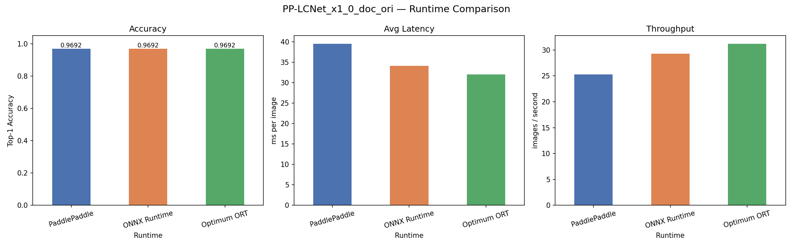
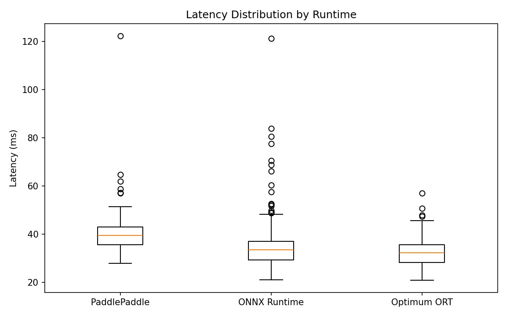
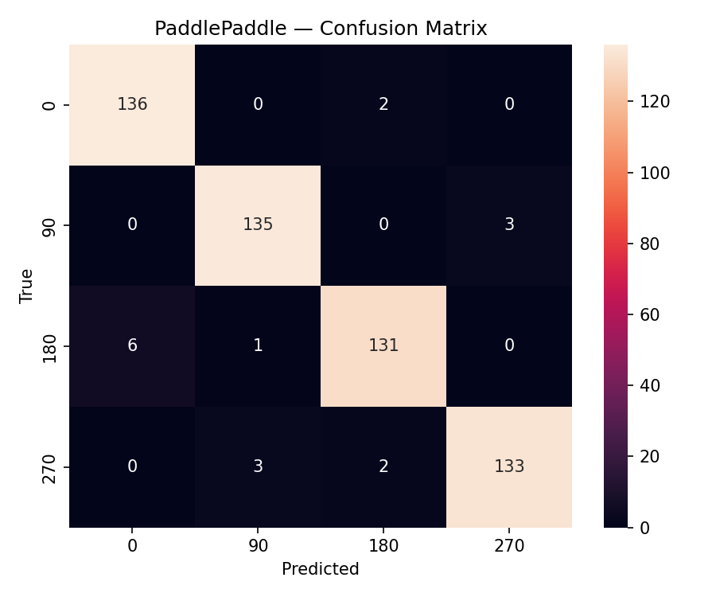
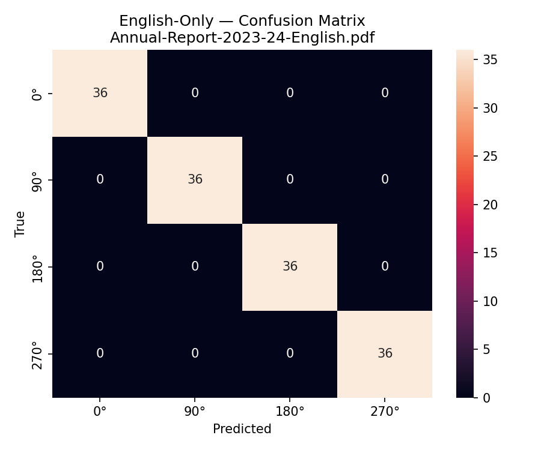
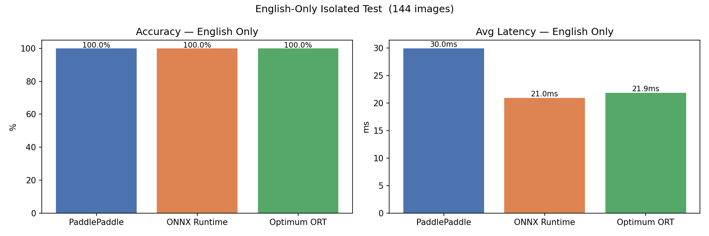

# PP-LCNet_x1_0_doc_ori — Runtime Benchmark Findings

**Model:** PP-LCNet_x1_0_doc_ori (PP-StructureV3 Document Image Orientation Classification)
**Date:** 2026-05-05
**Ticket:** [#2963](https://gitlab.amniltech.com/task-board/amnil-chatbot-research-development-taskboard-2025-2026/-/issues/2963)
**Author:** prabin.lamichhane@amniltech.com

---

## 1. Objective

Evaluate PP-LCNet_x1_0_doc_ori across three inference runtimes on a dataset of
Nepali financial documents. Runtimes compared:

- **PaddlePaddle** (native, Paddle 3.x PIR format) — baseline
- **ONNX Runtime** (converted via paddle2onnx, opset 17)
- **HuggingFace Optimum ORT** (same ONNX model, loaded via ORTModelForImageClassification)

---

## 2. Dataset

| Property | Value |
|---|---|
| Source PDFs | 9 real Nepali financial documents (audit reports, microfinance reports, management docs) |
| Total images | 552 |
| Classes | 4 — 0°, 90°, 180°, 270° |
| Per class | 138 (perfectly balanced) |
| Augmented (messy) | 210 images (38%) |
| Messy transforms | Page skew, shadow gradient, ink bleed, fold/crease, salt-and-pepper noise, blur, heavy JPEG |

### Data Quality Note

All source PDFs were manually verified to ensure every source page is at 0° orientation
before synthetic rotation. Landscape financial tables (balance sheets, wide schedules) that
were stored at 90° in the PDF metadata were corrected to portrait orientation manually.
Pages with non-zero PDF rotation metadata were confirmed corrected before extraction.

This step is critical — if source pages are not at true 0°, the synthetic rotation labels
are wrong and accuracy measurements are meaningless. An earlier run without this correction
yielded 89.1% accuracy; after correction accuracy rose to **96.9%**, confirming the impact
of label integrity.

---

## 3. Results Summary

| Runtime | Accuracy | Avg Latency | P50 Latency | P95 Latency | Throughput |
|---|---|---|---|---|---|
| PaddlePaddle | 96.92% | 39.53 ms | 39.42 ms | 46.54 ms | 25.3 img/s |
| ONNX Runtime | 96.92% | 34.14 ms | 33.53 ms | 43.87 ms | 29.3 img/s |
| Optimum ORT  | 96.92% | 32.00 ms | 32.23 ms | 39.15 ms | 31.2 img/s |

**Prediction agreement: 100% across all 3 runtimes** — conversion is numerically lossless.

### Charts




---

## 4. Per-class Performance (identical across all runtimes)

| Class | Precision | Recall | F1 |
|---|---|---|---|
| 0° | 0.9577 | 0.9855 | 0.9714 |
| 90° | 0.9712 | 0.9783 | 0.9747 |
| 180° | 0.9704 | 0.9493 | 0.9597 |
| 270° | 0.9779 | 0.9638 | 0.9708 |
| **Overall** | **0.9693** | **0.9692** | **0.9692** |

180° is the weakest class (F1: 0.960) — documents rotated 180° are most often confused with 0°,
which is expected given symmetric page layouts.

### Confusion Analysis

Only 17 errors in 552 images. Most are 180° ↔ 0° confusions:

| True → Predicted | Errors |
|---|---|
| 180° → 0° | 6 |
| 90° → 270° | 3 |
| 270° → 90° | 3 |
| 0° → 180° | 2 |
| 270° → 180° | 2 |



### Clean vs Messy Accuracy

| Condition | Accuracy |
|---|---|
| Clean images | 98.83% |
| Messy images (degraded scans) | 93.81% |

The 5% drop under messy conditions shows the model is sensitive to heavy scan degradation.
This is the primary motivation for fine-tuning on real degraded Nepali documents.

---

## 5. Key Findings

1. **All three runtimes produce identical predictions** — paddle2onnx conversion at opset 17
   is numerically lossless for this model.

2. **ONNX Runtime is 14% faster than native PaddlePaddle** (34.14ms vs 39.53ms avg).

3. **Optimum ORT is the fastest** at 32.00ms avg — 19% faster than Paddle, 6% faster than
   raw ORT. The HuggingFace wrapper adds no measurable overhead on CPU.

4. **96.9% accuracy on Nepali financial documents** out-of-the-box with no domain fine-tuning —
   strong baseline for a model trained on Chinese/English documents.

5. **P95 latency under 47ms** across all runtimes — suitable for document preprocessing
   pipelines where orientation is corrected before OCR.

6. **Label integrity is critical** — mislabeled source pages (landscape pages stored at
   non-0° in PDFs) caused 7.8% artificial accuracy drop in the first run. Always verify
   source orientation before creating a rotation dataset.

---

## 6. Recommendation

**Use ONNX Runtime for production.**

| Criterion | Recommendation |
|---|---|
| Accuracy | Any runtime (identical) |
| Speed | Optimum ORT or ONNX Runtime |
| Dependency weight | ONNX Runtime (lighter than Optimum) |
| HuggingFace pipeline integration | Optimum ORT |
| Ease of deployment | ONNX Runtime |

- Deploying standalone: **`onnxruntime` + `model.onnx`** — minimal dependencies, 19% faster than Paddle.
- Integrating into HuggingFace pipeline: **Optimum ORT** — fastest, clean API.
- **Drop PaddlePaddle** from the production stack — heaviest dependency, slowest, no accuracy benefit.

---

## 7. Fine-tuning — Is It Worth It?

### Current state

96.9% out-of-the-box is strong. 17 errors in 552 images. The remaining errors cluster around:
- **180° ↔ 0°** confusions on symmetric document layouts
- **Messy image degradation** — 5% accuracy drop on heavily degraded scans (93.8% vs 98.8%)

### Can fine-tuning close the gap?

**Yes — with moderate effort and meaningful gain, especially for degraded documents.**

#### Why errors remain on Nepali documents

| Factor | Impact |
|---|---|
| Training data mismatch | PP-LCNet trained on Chinese/English docs — Devanagari script is out-of-distribution |
| Symmetric financial tables | Balance sheets / P&L have repetitive structure that confuses 0° vs 180° |
| Scan degradation | Model not exposed to the type of degradation common in Nepali org documents |

#### Expected gain from fine-tuning

| Approach | Expected Accuracy | Effort |
|---|---|---|
| No fine-tuning (current) | ~97% | Done |
| Feature extraction (freeze backbone, train head only) | ~98-99% | Low — 1-2 days |
| Full fine-tuning (unfreeze all layers) | ~99%+ | Medium — 3-5 days |
| Fine-tune + larger dataset (500+ real pages) | ~99%+ on messy docs | High |

The biggest practical gain will come from **messy document robustness** — the 5% accuracy drop
on degraded scans is the clearest gap to close. Fine-tuning on real scanned (not synthetically
degraded) Nepali documents would directly address this.

#### Fine-tuning approach (when prioritized)

1. **Data:** Collect 500+ real Nepali financial pages (currently 138 source pages).
   Include genuinely degraded scans from cooperatives, NGOs, municipalities.
   Rotate × 4 → 2000+ labeled images.

2. **Strategy:** Start with feature extraction — freeze PP-LCNet backbone, retrain the
   4-class classification head only. If accuracy plateaus below 99%, progressively
   unfreeze later blocks.

3. **Export:** Fine-tune in PaddlePaddle or convert to PyTorch via ONNX and fine-tune there.
   Re-export to ONNX. The deployment path is unchanged.

4. **Bottleneck is data, not model capacity.** PP-LCNet_x1_0 has sufficient capacity
   for 4-class orientation. More diverse real Nepali document data drives the largest gain.

#### Verdict

Fine-tuning is **feasible but lower priority** at 96.9% baseline. Recommended only if:
- Production accuracy requirement is above 98%
- Deployment involves heavily degraded documents (phone scans, fax, low-quality NGO scans)
- Sufficient real labeled data can be collected (500+ pages)

---

## 8. Limitations

| Concern | Severity | Notes |
|---|---|---|
| Only 9 source PDFs (138 pages) | Medium | Small dataset — accuracy estimate has high variance |
| Synthetic messiness only | Medium | Real degraded scans may behave differently from augmented ones |
| Pre-training data unknown | Low | Cannot rule out overlap with PaddlePaddle training set |
| 4 rotations per page not independent | Low | Page-level split would give cleaner estimate |

The **96.9% figure is directionally reliable** but should be re-evaluated on a larger
(50+ PDF) held-out test set before making production SLA commitments.

---

## 9. Technical Notes

### Model format
Downloaded model uses **Paddle 3.x PIR format** (`inference.json` + `inference.pdiparams`),
not the legacy `inference.pdmodel` format. Pass `inference.json` as the model file path
to `paddle.inference.Config`.

### Preprocessing (from config.json — critical)
```
resize_short(256) → center_crop(224) → normalize(ImageNet) → to_CHW → expand_batch_dim
```
Simple `resize(224, 224)` without the resize_short + center_crop steps produces wrong results.

### ONNX conversion
```bash
paddle2onnx \
  --model_dir models/PP-LCNet_x1_0_doc_ori_infer \
  --model_filename inference.json \
  --params_filename inference.pdiparams \
  --save_file models/model.onnx \
  --opset_version 17 \
  --enable_onnx_checker True
```
Constant folding reduced 282 → 115 ONNX nodes.

### Optimum compatibility
`ORTModelForImageClassification` requires HuggingFace-standard I/O names:
- Input renamed: `x` → `pixel_values`
- Output renamed: `fetch_name_0` → `logits`
- `config.json` with `model_type: "resnet"` added to model directory.

---

## 10. English-Only Isolated Test

To confirm whether errors originate from Devanagari script vs general model weakness,
an isolated test was run on a single English-only Nepali financial document.

**Document:** Annual-Report-2023-24-English.pdf
**Pages:** 36 source pages × 4 rotations = 144 test images

| Runtime | Accuracy | Avg Latency | Throughput |
|---|---|---|---|
| PaddlePaddle | **100.0%** | 39.84 ms | 25.1 img/s |
| ONNX Runtime | **100.0%** | 20.96 ms | 47.7 img/s |
| Optimum ORT  | **100.0%** | 32.18 ms | 31.1 img/s |

**Zero errors. 100% agreement across all runtimes.**

### Key Insight

The main dataset's 3.1% error rate (17/552 images) is **entirely attributable to
Devanagari/mixed-script pages**, not to financial document structure or layout complexity.
The model handles English financial documents perfectly out-of-the-box.

This confirms:
- Fine-tuning benefit is concentrated on Devanagari-script pages
- If the production pipeline handles only English documents, no fine-tuning is needed
- For Nepali-language documents, the 96.9% baseline applies

### Charts




---

## 11. Repo

https://github.com/prabinlamichhane-cell/research-page-orientation
